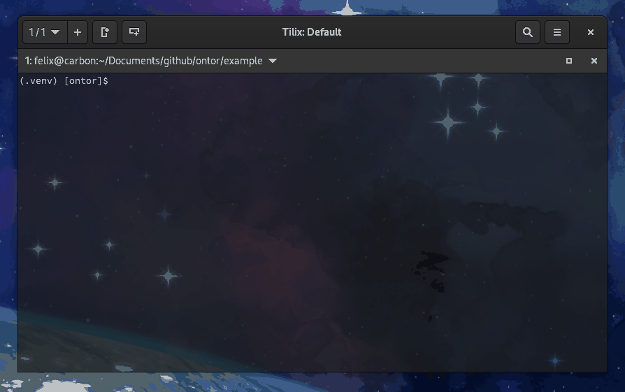
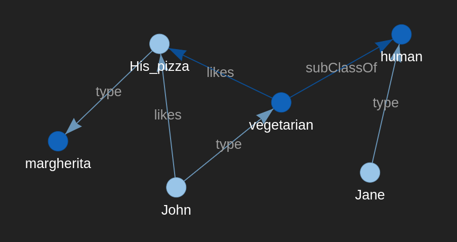

[](https://cloud.drone.io/felixocker/ontor)
[](https://felixocker-ontor.readthedocs.io/en/latest/?badge=latest)
[](https://www.gnu.org/licenses/gpl-3.0.html)

# ONTology editOR (ontor)
ontology editor built on [Owlready2](https://pypi.org/project/Owlready2/)

## functionality
each instance of the ontor class represents an individual ontology and provides support for:
* creating new, loading existing, and saving ontologies
* modifying ontologies:
  * import other ontologies
  * simply extract information such as axioms and class restrictions
  * insert classes, properties, instances, relations, and restrictions
  * delete classes, properties, instances, relations, and restrictions but preserve the ontology's structure by reassigning subclasses and instances appropriately
* reasoning over ontologies and debugging by interactively deleting problematic axioms
* visualizing the entire ontology or selected parts thereof

ontor provides a tuple based syntax with JSON and CSV support for ontology editing to facilitate focusing on the ontology's content

## requirements and installation
* Python 3.9+
* install ontor using pip
  * regular: ```pip install .```
  * editable mode: ```pip install -e .```
* generate documentation via sphinx using the makefile in *docs/*: ```make html```

## demo
the directory *example/* includes a demo application inspired by [Protégé's pizza example](https://protegewiki.stanford.edu/wiki/Protege4Pizzas10Minutes)

interactively debug an ontology\
in the example: ```ontor3.debug_onto()```



visualize selected instances, classes, and properties in a given radius around a focus node; e.g., all nodes in a radius of two relations around the node "John"\
in the example: ```ontor3.visualize(classes=["human", "pizza"], properties=["likes", "diameter_in_cm"], focusnode="John", radius=2)```



## license
GPL v3.0

## contact
Felix Ocker - [felix.ocker@googlemail.com](mailto:felix.ocker@googlemail.com)
